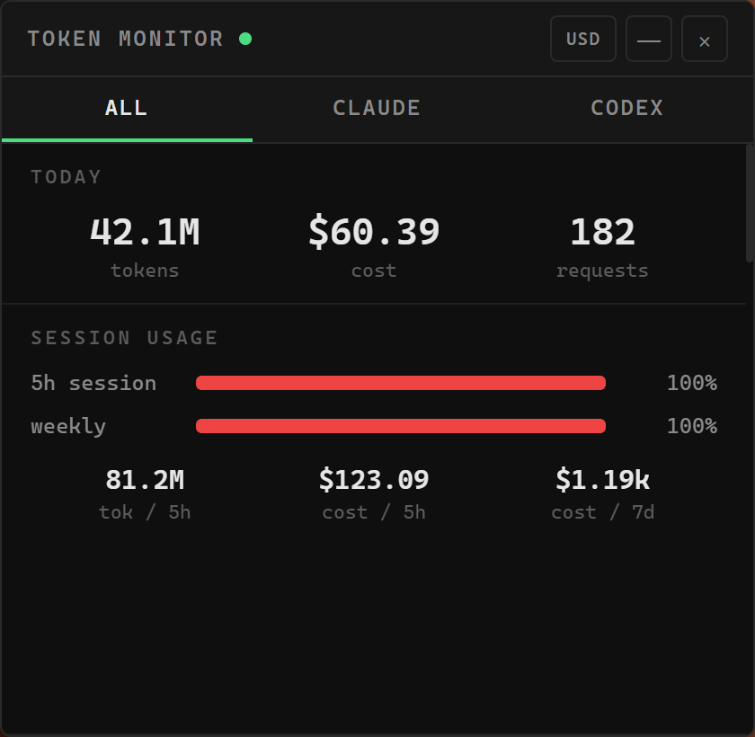

# AI Token Monitor

> **Claude Code · Codex CLI 토큰 사용량과 비용을 실시간으로 보여주는 데스크톱 오버레이**

## 1. 소개 (Introduction)

이 프로젝트는 로컬에 기록되는 Claude Code / OpenAI Codex CLI 세션 로그(JSONL)를 파싱해
토큰 사용량과 API 환산 비용을 한눈에 보여주기 위해 개발된 Electron 데스크톱 앱입니다.
화면 우측 하단에 항상 위에 떠 있는 작은 터미널 스타일 창으로, 로그 파일 변경을 감지해
**약 0.5초 내에 자동 갱신**되며 모든 데이터는 로컬에서만 처리됩니다.

<p align="center">
  
</p>

**주요 기능**

- **실시간 추적**: 로그 파일 변경 즉시 갱신(0.5초 디바운스) + 60초 폴백 폴링, mtime 기반 증분 파싱
- **정확한 집계**: Claude 로그 중복 라인 dedup(`message.id` 기준), Codex `token_count` 누적치 델타 집계
- **멀티 프로바이더**: ALL / CLAUDE / CODEX 탭, 일별 사용량을 프로바이더별 색상 스택 바로 표시
- **인포그래픽**: 오늘 요약, 세션·주간 한도 게이지, GitHub 스타일 활동 히트맵, 모델별 분석, 캐시 효율 도넛(절감액 추정 포함)
- **기간 통계**: 주간 / 월간 / 전체(all), `‹ ›` 화살표로 과거 탐색
- **통화 전환**: USD 기본, KRW 토글 — 실시간 환율(1일 주기) 적용, 실패 시 고정 1,540원
- **컴팩트 모드**: 타이틀바 `─` 클릭 시 오늘 요약만 보이는 초소형 바로 축소, `▴`로 복원
- **페이지 스크롤**: 휠 1틱마다 정확히 한 화면(섹션 그룹)씩 스냅 이동
- **트레이 상주**: `×`는 트레이로 숨기기, 트레이 클릭으로 토글, 단일 인스턴스 보장

> 표시되는 비용은 **API 정가 기준 추정치**입니다. 구독 요금제(Max/Plus 등) 사용 시 실제 청구액과 다릅니다.

## 2. 기술 스택 (Tech Stack)

- **Runtime**: Electron 28 (Node.js + Chromium)
- **UI**: Vanilla HTML / CSS / JavaScript — 프레임워크 없이 Canvas 2D + DOM으로 차트 렌더링
- **Data**: Node `fs` 기반 JSONL 증분 파서 (외부 DB·서버 없음, 전부 로컬 처리)
- **Packaging**: electron-builder — Windows NSIS 설치 파일 (macOS `.dmg` / Linux `.AppImage` 타깃 정의됨)
- **외부 API**: [open.er-api.com](https://open.er-api.com) 환율 1종 — 앱이 수행하는 유일한 네트워크 요청

## 3. 설치 및 실행 (Quick Start)

**요구 사항**: Node.js 18 이상, Windows 10/11 (주 지원 플랫폼)

1. **설치 (Install)**
   ```bash
   git clone https://github.com/JTech-CO/AI-Token-Monitor.git
   cd AI-Token-Monitor
   npm install
   ```

2. **실행 (Run)**
   ```bash
   npm start
   ```
   로그 파일이 없어도 정상 실행되며, 아래 경로에 파일이 생기면 자동으로 감지합니다.

   | 프로바이더 | 로그 경로 |
   |---|---|
   | Claude Code | `~/.claude/projects/**/*.jsonl` |
   | Codex CLI | `~/.codex/sessions/**/*.jsonl` |

3. **배포 빌드 (Build)**
   ```bash
   npm run build:win   # → dist/AI Token Monitor Setup x.x.x.exe
   ```
   설치 파일을 실행하면 바탕화면·시작 메뉴에 바로가기가 생성되어 더블클릭으로 실행할 수 있습니다.

   > 빌드 중 `Cannot create symbolic link` 오류가 나면 Windows **개발자 모드**를 켜거나
   > 관리자 권한 터미널에서 빌드하세요 (electron-builder의 winCodeSign 캐시 추출 이슈).

**설정 (Configuration)** — 환경 변수 없이 소스 상수로 조정합니다.

| 항목 | 위치 |
|---|---|
| 세션·주간 경고 한도 | `src/renderer/app.js` → `LIMITS` |
| 모델별 단가 (USD/MTok) | `src/usage.js` → `PRICING` |
| 고정 환율 폴백 | `src/main.js` → `FX_FALLBACK` |

## 4. 폴더 구조 (Structure)

```text
ai-token-monitor/
├── assets/            # 앱·트레이 아이콘
├── docs/              # README 스크린샷
├── src/
│   ├── main.js        # Electron 메인 프로세스 — 창·트레이·IPC·환율·파일 감시
│   ├── preload.js     # contextBridge (렌더러에 노출하는 API)
│   ├── usage.js       # 로그 파싱·비용 계산·집계 (Electron 비의존, node 단독 테스트 가능)
│   └── renderer/      # UI — index.html / style.css / app.js
└── package.json       # 스크립트 + electron-builder 설정
```

## 5. 정보 (Info)

- **License**: MIT